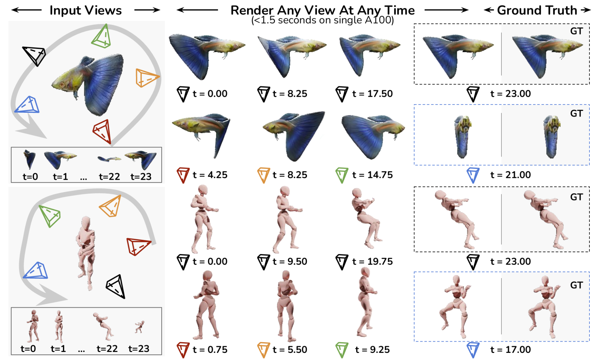
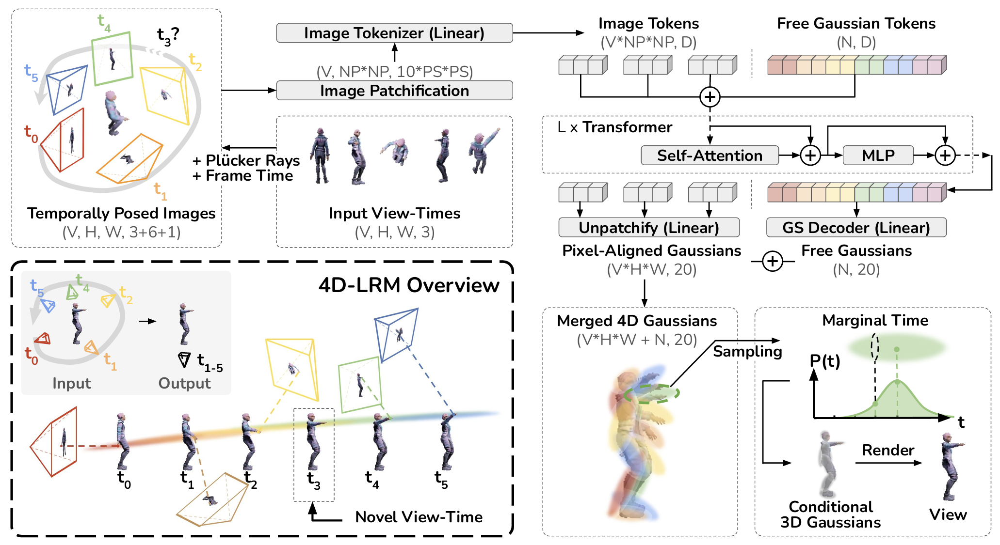

<h1 align="center"> 4D-LRM: Large Space-Time Reconstruction Model<br> From and To Any View at Any Time</h1>

<p align="center">
    <a href="https://mars-tin.github.io/" style="text-decoration: none;">Martin Ziqiao Ma</a>,
    <a href="http://xuweiyichen.github.io/" style="text-decoration: none;">Xuweiyi Chen</a>,
    <a href="https://yui010206.github.io/" style="text-decoration: none;">Shoubin Yu</a>,
    <a href="https://sai-bi.github.io/" style="text-decoration: none;">Sai Bi</a>,
    <a href="https://kai-46.github.io/website/" style="text-decoration: none;">Kai Zhang</a>,
    <a href="https://chenziwe.com/" style="text-decoration: none;">Chen Ziwen</a>,
    <a href="https://sihanxu.github.io/" style="text-decoration: none;">Sihan Xu</a>,
    <a href="https://jedyang.com/" style="text-decoration: none;">Jianing Yang</a>,
    <a href="https://zexiangxu.github.io/" style="text-decoration: none;">Zexiang Xu</a>,
    <a href="http://www.kalyans.org/" style="text-decoration: none;">Kalyan Sunkavalli</a>,
    <a href="https://www.cs.unc.edu/~mbansal/" style="text-decoration: none;">Mohit Bansal</a>,
    <a href="https://web.eecs.umich.edu/~chaijy/" style="text-decoration: none;">Joyce Chai</a>,
    <a href="https://www.cs.unc.edu/~airsplay/" style="text-decoration: none;">Hao Tan</a>
</p>

<p align="center">
    Adobe &nbsp;&nbsp;&nbsp; UMich &nbsp;&nbsp;&nbsp; UNC &nbsp;&nbsp;&nbsp;  UVA &nbsp;&nbsp;&nbsp; OSU
</p>



[](https://arxiv.org/)
[](https://4dlrm.github.io/)
[](https://huggingface.co/datasets)


This repository contains a *self-reimplemented (non-official!)* version of [**4D-LRM**](https://4dlrm.github.io/), including the model code, as well as training and evaluation pipelines. Part of the infrastructure is based on [**Long-LRM**](https://github.com/arthurhero/Long-LRM), credit to the amazing [Ziwen Chen](https://github.com/arthurhero).

## TODO List

## Precommit Setup
This is for the authors (and contributors), you can skip this step.

We use Google docstring format for our docstrings and the pre-commit library to check our code. To install pre-commit, run the following command:

```bash
pip install pre-commit  # or conda install pre-commit
pre-commit install
```

The pre-commit hooks will run automatically when you try to commit changes to the repository.

## Data Preparation


## Model Configuration



## Model Training
```bash  
torchrun --nproc_per_node $NUM_NODE --nnodes 1 \
         --rdzv_id $JOB_ID --rdzv_backend c10d --rdzv_endpoint localhost:$PORT \
         main.py --config path_to_your_config.yaml \
         --default-config path_to_your_default_config.yaml
```  

## Model Evaluation  
To run the evaluation loop, add the `--evaluation` flag to the command line:  
```bash  
torchrun --nproc_per_node $NUM_NODE --nnodes 1 \
         --rdzv_id $JOB_ID --rdzv_backend c10d --rdzv_endpoint localhost:$PORT \
         main.py --config path_to_your_config.yaml \
         --default-config path_to_your_default_config.yaml \
         --evaluation
```
